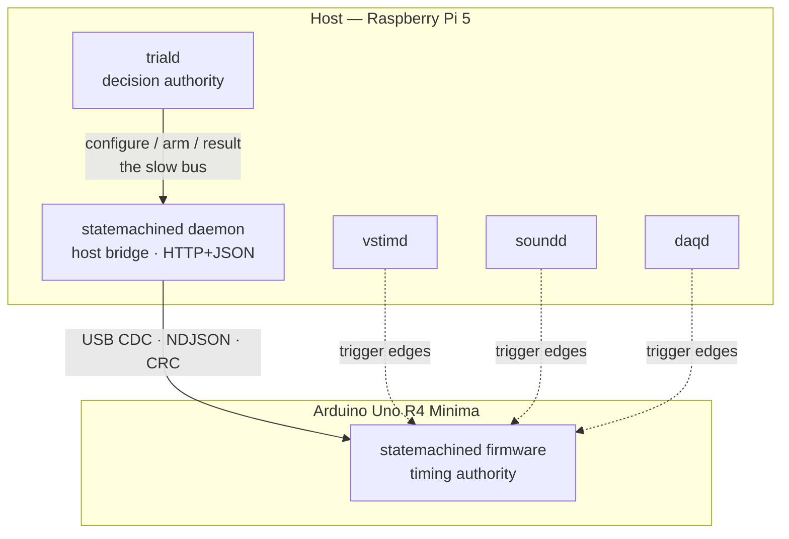

# { width="300" }{ width="300" }

!!! danger "Alpha software — not ready for production"
statemachined is at **v0.1.0-alpha1**. It has never controlled a session
with a subject in it, and it is not something a rig should depend on yet.
What is real: the portable core, the wire protocol and the Uno R4 Minima
HAL are implemented and tested — on the host, under sanitizers, on an
emulated board under Renode, and on a physical R4, which measured
**122 767 Hz** against the 10 kHz target. The rest is still being argued
out in the [plan](https://github.com/braemons/statemachined/blob/main/dev/PLAN.md).

**statemachined** is the part of a braemons rig that runs the _within-trial_
state machine on a microcontroller: it steps through a finite set of states,
each with a map of triggers to a next state, a timeout, and output actions,
and it **names the trial outcome**.

It is the participant that [triald](https://github.com/braemons/triald)'s plan
calls "the MCU" — the half of VStim's interval table that
[vstimd](https://github.com/braemons/vstimd)'s armed animations cannot
express: response windows, timeouts, reward, and an outcome.

**The division of authority.** statemachined is the _timing_ authority — it
debounces inputs, timestamps in its own clock, drives the valve, and names
the outcome. triald is the _decision_ authority — it chooses the trial type,
decides whether an outcome was _accepted_, and records what happened.
**The firmware never learns the trial type.**



!!! tip "New here? Start with these" - **[Bringing up a board](operations/bringup.md)** — the step-by-step
procedure for putting this firmware on an Uno R4 Minima, in the order
that makes each stage fail loudly on its own. - **[Hardware](operations/hardware.md)** — per-board pinouts and wiring,
including the line map, which is a wire contract in the same sense the
protocol is one. - **[The wire protocol](reference/protocol.md)** — the NDJSON framing and
the message catalogue the firmware speaks over USB CDC. - **[The HTTP API](reference/api.md)** — the daemon's interface, written
first and the daemon written against it. - **[The daemon](developer/daemon.md)** — the plan for the host process a
rig installs, and why a translator alone is not enough.

## What is distinctive

- **Triggers are predicates over the whole input word**, not edges on one
  line. Three bitmasks (`all` / `any` / `none`) firing on the predicate's own
  rising edge, so _"both levers held for 200 ms while the abort line is low"_
  is one condition rather than hand-rolled bookkeeping.
- **Randomised timings are drawn on the device** from a host-seeded
  deterministic PRNG — uniform, truncated exponential, discrete choice — with
  every realised duration reported back. Seeded so it replays; reported so it
  is evidence.
- **Terminal states name a `.tdr` outcome code** from triald's fixed
  taxonomy, which is a wire contract with years of recorded files behind it.
- **Cancellation is a forced transition** through the ordinary exit path, so
  every output a state raised is lowered by the same code that lowers it on
  any other transition. A valve cannot be left open by a graph that forgot
  something.
- **It can run with nothing attached.** A board remembers its wiring, its
  graph set and whether it should be arming its own trials, and comes up
  doing it after a power cut.
- **Portable core.** The engine, codec and protocol are plain C++17 with no
  `Arduino.h`; hardware is seven functions behind a HAL. The same code runs
  on the host, which is what makes the tests real.

## Drive it from Python

`python/` is one package with three tiers, and which one you install says how
you mean to drive a board.

```sh
pip install statemachined            # the documents, and talking to a daemon
pip install 'statemachined[device]'  # + open the serial port yourself
pip install 'statemachined[serve]'   # + be the daemon
```

=== "Through the daemon"

    When something other than your script owns the board — a rig, where
    `statemachined serve` is holding it and a web UI and triald are watching
    too:

    ```python
    from statemachined.client import StatemachinedClient

    with StatemachinedClient("http://rig-3.local:8081") as rig:
        rig.session.upload_graph_set(["go-nogo", "2afc"])

        with rig.trace.subscribe("my-experiment") as stream:
            rig.trial.configure(1, graph="go-nogo", cap_milliseconds=30_000)
            rig.trial.start(1)
            stream.wait_for_trial(1, timeout_seconds=35)

        for entry in rig.trace.for_trial(1):
            print(entry["kind"], entry.get("state_name"), entry.get("outcome"))
    ```

=== "Straight at the board"

    On a bench, with no daemon anywhere:

    ```python
    from statemachined.device import StatemachinedDevice
    from statemachined.model.graph_definition import GraphDefinition
    from statemachined.model.line_map import LineMap

    board = StatemachinedDevice("/dev/ttyACM0", line_map=LineMap.model_validate(wiring))
    board.connect_and_greet()
    board.push_wiring()
    board.upload_graph_set([GraphDefinition.model_validate(go_nogo)], set_version=1)

    result = board.run_trial_to_completion(1, "go-nogo", cap_milliseconds=30_000)
    # `.name`, not the member: TrialOutcome is an IntEnum and since Python 3.11
    # those print as their number. The `.tdr` taxonomy crosses the wire by name.
    print(result.outcome.name, [visit.state_name for visit in result.visits])
    ```

**Two classes and not one facade with two backends**, because the difference
is not the transport. A daemon keeps a trace ring, takes named recordings off
it, holds a graph store and saved configs on disk, and can say who else is
watching — all of which exist because it _outlives the script that spoke to
it_. A direct connection has no ring to record from. What they share is the
trial loop, the graph set, the wiring, autorun and save — because those are
the board's, not the daemon's.

## Target hardware

|                           |                                                                              |
| ------------------------- | ---------------------------------------------------------------------------- |
| **Arduino Uno R4 Minima** | Reference target. 32 KB RAM, and the constraint that keeps the design honest |
| **Teensy 4.1**            | The headroom target, and Bpod's own board                                    |
| **ESP32**                 | WiFi and BT stay off in the trial loop                                       |
| **native**                | Unit tests and the simulator — the same `core/`, on the host                 |
